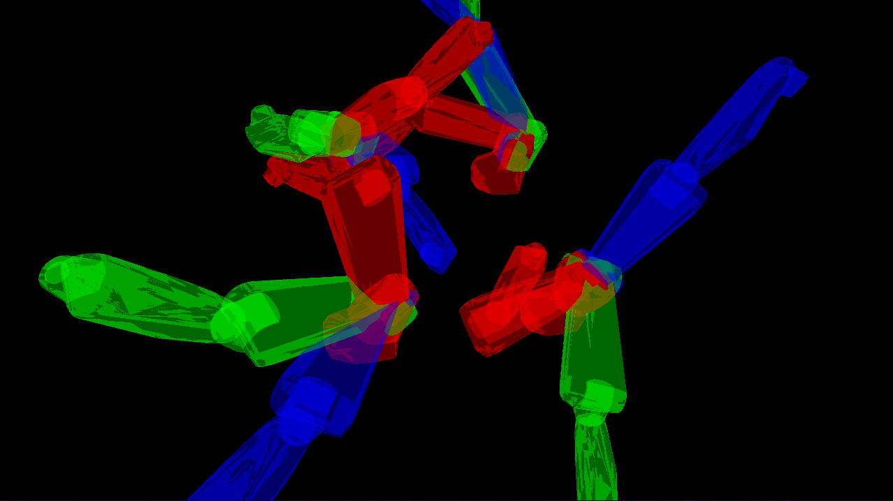

## Buran Motion Planning Framework

Фрейморк для планирования движения систем роботов-манипуляторов.

[Обзорная статья на хабре](https://habr.com/ru/articles/752996/), с документацией
Вы можете ознакомиться по [ссылке](https://habr.com/ru/articles/752996/), автоматическая
`doxygen` документация выложена [здесь](https://doc.bmpf.buran.center/)



## Зависимости

Приложение использует следующие библиотеки: `OpenGL`, `Eigen3`, `jsoncpp`, `QT`, `Boost`

Чтобы их установить в `Ubuntu`, выполните следующие команды:

```
sudo apt-get update
sudo apt-get install libglu1-mesa-dev freeglut3-dev mesa-common-dev libeigen3-dev libjsoncpp-dev libboost-all-dev liburdfdom-dev qt5-default libtbb-dev libtinyxml-dev 
```

## Документация

```
sudo apt update
sudo apt install doxygen doxygen-gui doxygen-latex
```

`Doxygen` использует `Doxyfile` в корне проекта,
чтобы его сгенерировать заново, нужно запустить команду 

```
doxygen -g
```

Для генерирования документации нужно запустить такую же 
команду, но без флага

```
doxygen
```

Похоже, что doxygen не документирует поля классов

Главный страница сайта `html/index.html`

Заглушка содержимого главной страницы в файле `mainpage.dox`

## Сборка deb акета

https://www.iodigital.com/nl/history/intracto/creating-debianubuntu-deb-packages

Чтобы установить deb-пакет, нужно скачать его. После этого нужно вызвать команду

```
dpkg -i bmpf.deb
```

Чтобы удалить установленный пакет, нужно вызвать команду

```
sudo dpkg -r bmpf
```

deb-пакет собирается автоматически с помощью jenkins. Чтобы получить актуальную
версию, нужно просто скачать его из `Workspace` jenkins
